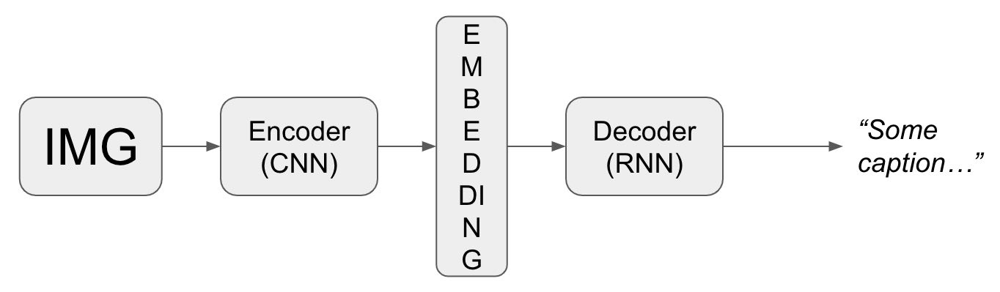

# Chapter 2: Data Representation Design Patterns

At the heart of any ML model is a mathematical function that operates on specific data types. Real-world data may not be directly pluggable into the mathematical function. Therefore, we need _data representations_.

The process of creating features to represent the input data is called _feature engineering_, and so we can think of feature engineering as a way of selecting the data representation.

The process of learning features to represent the input data is called _feature extraction_, and we can think of learnable data representations (like embeddings) as automatically engineered features.

The data representation doesn't need to be learned or fixed - a hybrid is also possible.

We may represent input data of different types separately, or represent each piece of data as just one feature - _multimodal input_.

There are four data representations:

* [Simple Data Representation](#simple-data-representations): eg _scaling_, _normalizing_, etc
* Design Pattern 1: [Hashed Feature](#design-pattern-1-hashed-feature)
* Design Pattern 2: Embeddings

---

## Simple Data Representations

Not a feature representation design pattern, but a common practice in ML models.

### Numerical Inputs

For numerical values, we often scale them to take values in [-1, 1]. Why?

* ML frameworks use optimizers that are tuned to work well with numbers in this range. Thus, it improves the accuracy of the model.
* Some ML algorithms are sensitive to relative magnitude of features (eg K-Means).
* It also improves L1 and L2 regularization; we ensure that there is not much difference between variables.

What are different types of scaling?

* **Linear scaling**
  * _Min-max scaling_
  * _Clipping_
  * _Z-score normalization_
  * _Winsorizing_ (clip data outside 10 and 90 percentiles)
* **Nonlinear transformations**
  * If data is skewed or is not uniformly distributed or is not distributed like Gaussian...
  * We apply _nonlinear transformation_ before scaling (to make them look like a bell shape)
    * Custom functions: e.g. _log_ $\rightarrow$ _fourth root_ $\rightarrow$ ...
    * _Bucketize_: so bucket boundaries fit the desired distribution
    * _Box-Cox transform_: this method chooses its single parameter ($\lambda$) to control the "heteroscedasticity", so that the variance no longer depends on the magnitude.

### Categorical Inputs

Most ML models perform on numerical values. Thus, we need to transform our categorical data into numbers.

* **One-hot encoding:** converts a categorical feature into a vector of size _vocabulary_

  (eg `"English"` $\rightarrow$ `[0, 0, 1, 0, ..., 0]`)

* **Array:** if the array of categories is of fixed length, we can treat each _array position_ as a feature.

---

## Design Pattern 1: Hashed Feature

There are certain problems with **categorical features**. Namely,

* <span style="color:darkred">_incomplete vocabulary_</span>: training data does not contain all the possible values.
* <span style="color:darkred">_high cardinality_</span>: a feature vector may have a length of thousands to millions.
* <span style="color:darkred">_cold start_</span>: after the model is placed into production, new data is introduced.

**Hashed Feature** design pattern represents categorical variables by:

1. Converting the categorical input into a unique string.
2. Applying a deterministic hashing algorithm on the string.
3. Taking the remainder of hash result divided by the desired number of buckets.

It's easy to see that all three above-mentioned issues are addressed.


**Tradeoffs and alternatives**

- <span style="color:darkred">_Bucket collision_</span>: different values may share the same bucket.
- <span style="color:darkred">_Skew_</span>: same bucket but vastly different? (eg. `Chicago airport` in the same bucket as `Vermont airport`)
- <span style="color:darkgreen">_Aggregate features_</span>: it may be helpful to add an aggregate feature so the difference between different-values-placed-in-the-same-bucket is preserved. (eg. `number_of_flights`)
- <span style="color:darkgreen">_Hyperparameter tuning_</span>: to find the best number of buckets.
- <span style="color:darkred">_Cryptographic hash_</span>: not reproducible. That's why we use _fingerprint_ hashing.
- <span style="color:darkgreen">_Order of operations_</span>: The order of operations (eg. `ABS(MOD(FINGERPRINT(value), num_buckets)))`) is important for reproducibility.
- <span style="color:darkred">_Empty hash buckets_</span>: It would be useful to apply L2 regularization to lower the weights associated with an empty bucket to near zero.

---

## Design Pattern 2: Embeddings

_Embeddings_ are a learnable data representation that map data into a lower-dimensional space in such a way that the information relevant to the learning problem is preserved. They provide a way to handle disparate data types in a way that preserves similarity between items and thus improves our model's ability to learn those essential patterns.

Remember **one-hot-encoding**? What if we had many categories to consider? Also, it treats the categorical variables as being _independent_. That might not be the case.

Embeddings address both problems.

### Text embeddings

Text provides a natural setting where it is advantageous to use an _embedding_ layer. To do that in Keras, see the following example:

```python
# First, we create a tokenization for each word in our vocabulary.
tokenizer = keras.preprocessing.text.Tokenizer()
tokenizer.fit_on_texts(titles_df.title)

# Second, we use |texts_to_sequences| method to convert words into their indices.
integerized_titles = tokenizer.texts_to_sequences(titles_df.titles)

# Third, we pad sentences so all of them have the same length.
VOCAB_SIZE = len(tokenizer.index_word)
MAX_LEN = max(len(sequence) for sequence in integerized_titles)
def create_sequences(texts, max_len=MAX_LEN):
  sequences = tokernizers.texts_to_sequences(texts)
  padded_seqs = keras.preprocessing.sequence.pad_sequences(sequences,
                                                           max_len,
                                                           padding='post')
  return padded_seqs

# Finally, we can pass our |padded_sequences| to the model.
model = keras.models.Sequential([
  keras.layers.Embedding(input_dim=VOCAB_SIZE + 1,
                         output_dim=embed_dim,  # arbitrary embedding length
                         input_shape=[MAX_LEN]),
  keras.layers.Dense(N_CLASSES, activation='softmax')  # example: sentiment analysis
])
```

### Image embeddings

Data types, such as images or audio, consist of dense and high-dimensional vectors. Therefore, lowering dimensionality by learning _embeddings_ are essential.

For image embeddings, there are several pretrained CNN architectures - like Inception or ResNet - available. We usually use these pretrained CNNs by removing the last _softmax_ layer to obtain a lower-dimension embedding for our images. Then we can plug that embedding layer into our network for our purpose. Suppose we have an _image captioning_ task at hand:



**Tradeoffs and alternatives**

* <span style="color:darkgreen">_Choosing the embedding dimension_</span>: by lowering the dimensionality, we lose some information. The optimal embedding dimension is a hyperparameter that we need to tune.
* <span style="color:darkgreen">_Autoencoders_</span>: Training embeddings in a supervised way may require a lot of labeled data. If that is not possible, we can set up an _autoencoder_ network to obtain the embeddings.


* <span style="color:darkgreen">_Context language models_</span>: a pretrained text embedding, like Word2Vec or BERT, can be added to a ML model to process text features in conjunction with learned embeddings from image/video/... input.
  * _Word2Vec_: Bag of Words + skip-gram
  * BERT: masked language model + next sentence prediction. Therefore, it can understand the difference between `Apple` as the fruit or as the company.
* <span style="color:darkgreen">_Embeddings in a data warehouse_</span>: we can load a pretrained model into our data warehouse and use it to transform text column into an embedding array. (More on this in Chapter 6)

---

## Design Pattern 3: Feature Cross

A _feature cross_ is formed by concatenating two or more categorical features in order to capture the _interaction_ between them. It would also make it possible to encode _nonlinearity_ into the model.

Complex models like neural networks and trees do this automatically, but performing _feature cross_ can help **simpler linear models to improve**. It will also allow **data warehouse queries** to provide quick analytical reports.

**Tradeoffs**

* <span style="color:darkred">_Handling numerical features_</span>: the space is infinte for continous variables. We should bucketize the data to make them categorical.
* <span style="color:darkred">_Handling high cardinality_</span>
* <span style="color:darkred">_Need for regularization_</span>

---

## Design Patter 4: Mutltimodal Input

