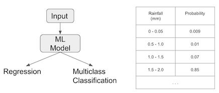

# Chapter 3: Problem Representation Design Patterns

This chapter looks at different types of ML problems and analyzes how the model architecture vary depending on the problem.

* _[Reframing](#Design-Pattern-5-Reframing)_ design pattern takes a solution that is intuitively a regression problem and poses it as a classification problem (and vice versa).
* _[Multilabel](#Design-Pattern-6-Multilabel)_ design pattern handles the case that training examples can belong to more than one class.
* _[Ensemble](#Design-Pattern-7-Ensembles)_ design pattern solves a problem by training multiple models and aggregating their responses.
* _Cascade_ design pattern addresses situations where a ML problem can be broken into a series (or cascade) of ML problems.
* _Neutral Class_ design pattern recommends approaches to handle highly skewed or imblalanced data.

---

## Design Pattern 5: Reframing

**Example: Rainfall Estimation**

Let's assume we are trying to train a model to estimate _rain fall_ given certain conditions. Since we are measuring rain fall, it is naturally seen as a regression problem. But we realize that our model is always off. We can calculate more features, train different models, etc. However, one way to improve the result is by _reframing_ it as a classification problem. I.e., model a discrete probability distribution.



Modeling a distribution this way is advantageous since rainfall does not exhibit the typical bell-shaped curve of a normal distribution. For other cases that we have _bimodal_ or even normal distribution but with high variance, this approach is suitable.


**Example: Video Recommendation**

Training a classifier to predict whether a user would click on a video title may prioritize click baits. Instead, we can reframe this problem as a regression problem of predicting the fraction of the video that will be watched. (**change of objective**)

---

When reframing a regression into a classification problem, we relax our prediction target to be instead a discrete probability distribution. We lose a little precision due to bucketing, but gain **expressiveness of a full prbability density function (PDF)**. Also, our model is more adept at learning a complex target than the more rigid regression model.

By looking at the output probability distribution we can **capture uncertainties**. The width of of the distribution tells us about the irreducible error.

* If it is very wide, that means we have a lot of variance.
* If it is very sharp and narrow, that means we do not have much error and perhaps a regression model can do just fine.

---

**Tradeoffs and alternatives**

* _Bucketized outputs_: the typical approach is to bucketize the output values and treat the problem as a multiclass classification problem. Therefore, we lose precision. This may or may not be acceptable.
* _Restricting the prediction range_: It may or may not be desired. For cases that we want to restrict the range of the prediction outputs, this approach, reframing a regression problem into a classification problem is beneficial.
* _Label bias_: in the "video recommendation" example we saw that predicting labels brings a bias with it; we may prioritize click baits. Using a regression model (estimate the watch time) resloves this issue.
* _Multitask learning_: instead of reframing a regression problem into a classification problem (or vice versa), we can do both! One model tries to optimize two different objective functions; therefore, we have _parameter sharing_ between two cases. This may be helpful, as previous cases show that it outpeforms two independent models; e.g., _predicting object types (classification prob) and the bounding boxes (regression)_.

---

## Design Pattern 6: Multilabel

_Multilabel_ classification means we can assign more than one label to a given training example. Not that this is different from _multiclass_ classification problems, where a signle example is assigned exactly one label from a group of many (>1) possible classes; if we could pick more than one label, then that would be _multilabel, multiclass classification_.

An example for _multilabel_ classification is "determining tags for Stack Overflow questions." Each question can be tagged with multiple labels; e.g., "Python", "pandas", and "visualization."

---

**Use sigmoid!**

The solution for building models that can assign more than one label to a given training example is to use the _sigmoid_ activation function in our final output layer. (Rather than generating an array where all values sum to 1 - _softmax_)

The number of units in the final layer is the same as the number of classes. Each output will be assigned a sigmoid value.

```python
model = keras.Sequential([
  keras.layers.Flatten(input_shape=(28, 28)),
  keras.layers.Dense(128, activation='relu'),
  keras.layers.Dense(3, activation='sigmoid')  # We can assign three labels to each example.
])
```

---

**Tradeoffs and alternatives**

* **Which loss function?** the book suggests using `binary_crossentropy` for binary and multilabel models. This is because a multilabel problem is essentially several binary classification problems.
* **How to parse sigmoid results?** for _softmax_ case, we could simply use `argmax` to find the class label. For multilabel with sigmoid values, the book suggests using a _probability threshold_. Any value greater than threshold should be considered as the predicted label.
* **Dataset considerations:** Building a balanced dataset is more nuanced for the _Multilabel design pattern_. There is usually a hierarchy to the predicted labels. We can (i) use a flat approach and have one layer with all labels; or (ii) use the _Cascade_ design patterhn; i.e., one model identifies higher-level labels, and more specific ones are assigned by other models.
* **One-versus-rest:** For _Multilabel_ classification we can train multiple binary classifiers instead on one multilabeled model. It's called _one versus rest_. Each binary classifier identifies whether or not to assign its label. The benefit is that we can use model architectures that are mostly suitable for binary classifications, such as SVM.

---

## Design Pattern 7: Ensembles

