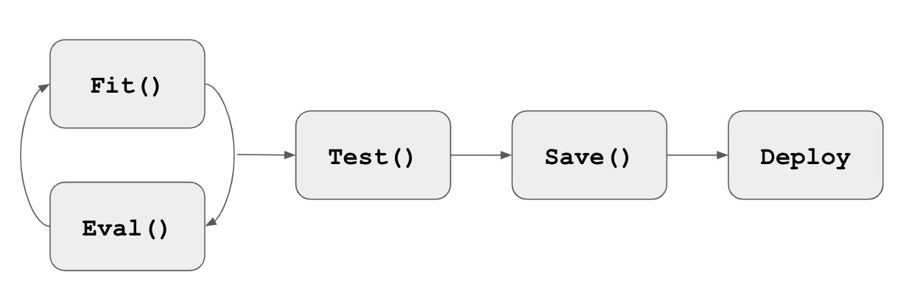
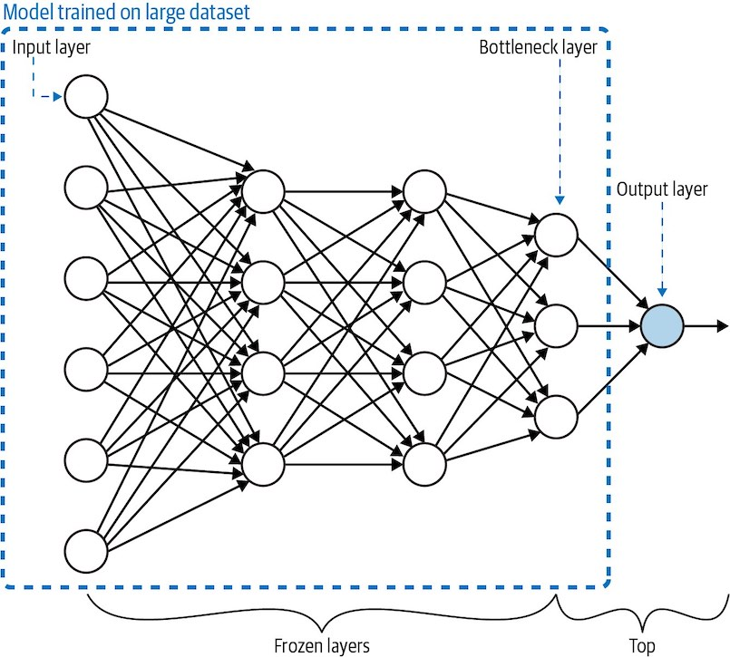

# Chapter 4: Model Training Patterns

ML models are usually trained iteratively, and this iterative process is informally called the _training loop_. In this chapter, we talk about the typical training loop and design patterns which are suitable for cases we have to deviate from the typical route. Namely,

* **[Useful Overfitting](#Design-Pattern-11-Useful-Overfitting):** we forgo the use of a validation or testing dataset, because we want to intentionally overfit on the training dataset.
* **[Checkpoints](#Design-Pattern-12-Checkpoints):** we store the full state of the model periodically, so we have access to partially trained models.
* **[Transfer Learning](#Design-Pattern-13-Transfer-Learning):** we take part of a previously trained model, freeze the weights, and incorporate these nontrainalbe layers intoa new model that solvess the same problem, but on a smaller dataset.
* **[Distribution Strategy](#Design-Pattern-14-Distribution-Strategy):** the training loop is carried out at scale over multiple workers.
* **[Hyperparameter Tuning](#Design-Pattern-15-Hyperparameter-Tuning):** the training loop itself is inserted into an optimization method to find the optimal set of model hyperparameters.

## Typical Training Loop

The most common approach to determining the parameters of ML models is _gradient descent_. On large datasets, gradient descent is applied to mini-batches of the input; that is called _stochastic gradient descent_ (SGD).

Because SGD requires training to take place iteratively on small batches of the training dataset, training an ML model happens in a loop. SGD finds a minimum, but is not a closed-form solution, and so we have to detect whether the model convergence has happend. _Overfitting_ is yet another challenge that we need to detect during training. Therefore, the error (or _loss_) on the training and validation sets have to be monitored.



The typical training loop in Keras looks like this

```python
model = keras.Mode(...)
model.compile(optimizer='adam',
             loss='categorical_crossentropy',
             metrics=['accuracy'])
history = model.fit(X_train, y_train,
                   batch_size=32,
                   epochs=5,
                   validation_data=(X_valid, y_valid))
results = model.evaluate(X_test, y_test, batch_size=64)
model.save(...)
```

---

## Design Pattern 11: Useful Overfitting

The goal of an ML model is to generalize and make reliable predictions on new, unseen data. If the model _overfits_ the training data, its ability to generalize suffers.

However, in certain situations _overfitting_ may be required.

Consider a situation of simulating the behavior of physical or dynamical systems (as in computational biology or computational finance), where the time dependence of observations can be described by a mathematical function or set of partial differential equations (PDEs). Although the equations can be formally expressed, they don't have a closed-form solution. Classical numerical methods have been developed to approximate solutions to these systems. However, they can be too slow to be used in practice.

ML models can serve as lookup tables of inputs to outputs. In these scenarios **there is no "unseen" data** that needs to be generalized. Thus, all possible inputs are tabulated and that is not considered as overfitting.

In short, we want the model to memorize the output of a function for all possible inputs.

---

## Design Pattern 12: Checkpoints

As model sizes increase, the time it takes to fit one batch of examples also increases. When there's a problem, e.g., the model starts overfitting the data, or a hardware failure, etc, we would like to be able to resume from an intermediate point, instead of from the very beginning.

At the end of each epoch, we can save the _model state_.

What's the difference between _exported model_ and a _model state_? We export the model for deployment. An _exported model_ does not contain the entire model state, just the information necessary to create the _prediction_ function. A _model state_, on the other hand, must know the epoch number, batch number, learning rate, and in case of RNNs, a history of previous input values. In general, the full model state can be many times the size of the exported model.

Saving the full model state so that model training can resume from a point is called _checkpointing_.

To **checkpoint a model in Keras**, provide a callback to the `fit()` method:

```python
checkpoint_path = '{}/checkpoints/'.format(OUTDIR)
checkpoint_cb = keras.callbacks.ModelCheckpoint(checkpoint_path,
                                                save_weights_only=False,
                                                verbose=1)
history = model.fit(X_train, y_train,
                    batch_size=32,
                    epochs=3,
                    validation_data=(X_valid, y_valid),
                    verbose=2,
                    callbacks=[checkpoint_cb])
```

The availability of partially trained models opens up a number of other usecase. This is because the partially trained models are usually more generalizable.

**Tradeoffs and alternatives**

* **Early stopping**. The longer you train, the lower the loss on the training dataset. If you are starting to overfit to the training dataset, the validation error might start to increase. In such cases, it can be helpful to look at the validation error at the end of every epoch and stop the training process when the validation error is more than that of the previous epoch.
* **Checkpoint selection**. It is not uncommon for validation error to increase a bit and then start to drop again. Thus, the book recommends training longer and choosing the optimal run as a postprocessing step.
* **Regularization**. If we apply L2 regularization, the validation error does not increase. Instead, both the training loss and validation error should plateau. It's called a _well-behaved_ training loop. Applying regularization may be better than _early stopping_, because it allows you to use the entire dataset to change the wieghts of the model, whereas early stopping requires you to waste 10%-20% of your dataset.
  * Furthermore, recent research indicates that _double descent_ happens in a variety of ML problems, and therefore, it is better to train longer rather than risk a suboptimal solution by stopping early.
* **Fine-tuning**. Imagine that you need to priodically retrain the model on fresh data. You typically want to emphasize the fresh data, not the corner cases from last month. You are often better off resuming your training some epochs earlier than the last checkpoint.
* **Redifining an epoch**. If a dataset fit in memory, we can define epochs to go over that dataset multiple times.

```python
model.fit(X_train, y_train,
          batch_size=32,
          epochs=15)
```

​		However, not all data fit in memory. To make the ocde more resilient, we supply a TensorFlow dataset - an out-of-memory dataset. It provides iteration capability and lazy loading. The code becomes

```python
checkpoint_cb = keras.callbacks.ModelCheckpoint(...)
history = model.fit(train_ds,
                    batch_size=32
                    epochs=15,
                    validation_data=valid_ds,
                    callbacks=[checkpoint_cb])
```

​		However, **using epochs on large datasets remains a bad idea**.

​		- Dataset grow over time. If you get 100K more examples and get a higher error, is it because you need to do an early stopping, or is the new data corrupt?

​		- You checkpoint once per epoch, and waiting one million examples between checkpoints might be way too long! For resilience, we may want to checkpoint more often.

​		**Steps per epoch**. Instead of trainig for 15 epochs, we may decide to train for 143,000 steps.

```python
NUM_STEPS = 143000
NUM_CHECKPOINTS = 15
history = model.fit(train_ds,
                    batch_size=32,
                    epochs=NUM_STEPS // NUM_CHECKPOINTS,
                    validation_data=valid_ds,
                    callbacks=[checkpoint_cb])
```

​		Each step involves weight updates based on a single mini-batch of data, and this gives us much more granularity; e.g., stopping at 14.3 epochs.

**Note:** It works as long as we make sure to repeat the `train_ds` infinitely, otherwise, it will exit after the first epoch.

```python
train_ds = train_ds.repeat()
```

* **Retraining with more data**. Say we get 100,000 more examples. We add it to our data warehouse but do not update the coee. Our code will still want to process the number of steps we specified, and it will get to process that much data, except that 10% of the examples are newer.

---

## Design Pattern 13: Transfer Learning

Training custom ML models on unstructured data requires extremely large datasets, which are not always readily available. Consider the case of

* a model identifying whether an x-ray of an arm contains a broken bone.
* a model that takes descriptions of patient symptoms and predicts the possible conditions associated with those symptoms.

Because use cases like the image and text examples described above involve particularly specialized data domains, it's also not possible to use a general-purpose model to successfully identify bone fracture or diagnose diseases.

To handle this, we need a solution that allows us to build a custom model using only the data we have available and with the labels we care about.

**How to do that?** With _Transfer Learning_ design pattern, we can take a model that has been trained on the same type of data for a similar task and apply it to a specialized task using our own custom data.

By "same type of data", we mean the same data modality - images, or texts.

---

**Bottleneck layer**



When we load a pre-trained model, the last layer before the output layer is the **bottleneck layer**. It represents the input in the lowest-dimensionality space. In a way, we can consider this as **embeddings** that we use in our model.

```python
vgg_model = keras.applications.VGG19(
  include_top=False,
  weights="imagenet",
  input_shape=((150, 150, 3))
)
vgg_model.trainable = False
```

By setting `include_top=False`, we're specifying that the last layer of VGG we want to load is the bottleneck layer. We've also set `vgg_model.trainable=False`, which means we don't want its parameters to be updated during our training.

---

**Implementing transfer learning**

You can implement transfer learning in Keras using one of these two methods:

1. Loading a pre-trained model on your own, removing the layers after the bottleneck, and adding a new final layer with your own data and labels. (Example: _classify colorectal histology images_)

```python
global_avg_layer = keras.layers.GlobalAveragePooling2D()
feature_batch_avg = global_avg_layer(feature_batch)

prediction_layer = keras.layers.Dense(8, activation='softmax')
prediction_batch = prediction_layer(feature_batch_avg)

histology_model = keras.Sequential([
  vgg_model,
  global_avg_layer,
  prediction_layer
])
```


2. Using a pre-trained TensorFlow Hub (https://tfhub.dev) module as the foundation for your transfer learning task. (Example: _movie review semantic analysis_)

```python
hub_layer = hub.KerasLayer(
  "https://tfhub.dev/google/tf2-preview/gnews-swivel-20dim/1",
  input_shape=[], dtype=tf.string, trainable=True)

movie_review_model = keras.Sequential([
  hub_layer,
  keras.Layers.Dense(32, activation='relu'),
  keras.Layers.Dense(1, activation='sigmoid')
])
```

---

**Tradeoffs and alternatives**

* Fine-tuning vs feature extraction

_Feature extraction_ describes an approach to transfer learning where you freeze the weights of all layers before the bottleneck layer and train the following layers on your own data and labels.

_Fine-tuning_ is for updating the weights of the pre-trained model's layers. With fine-tuning, we may either update the weights of each layer in the pre-trained model, or just a few of the layers right before the bottleneck.

When _fine-tuning_, it's common to leave the weights of the model's initial layers frozen since these layers have been trained to recognize basic features.

```python
base_model = keras.applications.MobileNetV2(input_shape=(160, 160, 3),
                                            include_top=False,
                                            weights='imagenet')
for layer in base_model.layers[:100]:
  layer.trainable = False  # Keep the first 100 layer unchanged.
```

One recommended approach to determining how many layers to freeze is known as _progressive fine-tuning_. It involves iteratively unfreezing layers after every training run to find the ideal number of layers to fine-tune. This works best and is most efficient if you keep your learning rate low (e.g., 0.001) and the number of training iterations relatively small.

How should you determine whether to **fine-tune or feature extraction**?

1. If you've got a small dataset, it's best to use the pre-trained model as a feature extractor rather than fine-tuning. Fine-tuning can cause the updated model to overfit to your small dataset.
2. How similar your prediction task is to that of the original pre-trained model? If it is similar, fine-tuning can produce higher-accuracy results. When the task is different or the datasets are significantly different, it's best to freeze all the layers of the pre-trained model.

Here's a summary:

| Criterion                                                    | Feature extraction | Fine-tuning   |
| ------------------------------------------------------------ | ------------------ | ------------- |
| How large is the dataset?                                    | Small              | Large         |
| Is your prediction task the same as that of the pre-trained model? | Different tasks    | Similar tasks |
| Budget for training time and computional cost                | Low                | High          |


* Focus on image and text models

Transfer learning is primarily for cases where you can apply a similar task to the same data domain. Models trained with tabular data, however, cover a potentially infinite number of possible prediction tasks and data types. That is the reason _Transfer learning_ is typically focused on image or text models.

(TabNet presents novel research in this area)


* Embeddings of words versus sentences

What we've seen so far has been _word embedding_. However, there could be a problem. See the following example:

"_I've left you fresh baked cookies on the left side of the kitchen counter._"

The word "_left_" appears twice and each has a different meaning. However, _word embeddings_ would be the same.

_Sentence embeddings_ represent the entier sentences. It's training a supervised learning model to generate those embeddings. This is the approach used by Google's Universal Sentence Encoder and BERT. These methods differ from word embeddings in that they go beyond simply providing a weight lookup for individual words. Instead, they have been built by training a model on a large dataset of varied text to understand the meaning conveyed by _sequence of words_.

---

## Design Pattern 14: Distribution Strategy

As the size of models and data incrases, the computation and memory demands increase proportionally, making the time it takes to train these models one of the biggest problems of deep learning. If it takes two weeks to train your neural network, then you have to wait two weeks before you can iterate on new ideas or experiment with teaking the settings. This is a problem.

One way to accelarate training is through **distribution strategies** in the training loop. The common idea is to split the effort of training the model across different machines. There are two ways to do this:

* **Data parallelism**: computation is split across different machines and **different workers train on different subsets of the training data**.
* **Model parallelism**: the model is split and different workers carry out the computation for different parts of model. (<u>NOT the focus of this book</u>)

---

**Synchronous training**

In synchronous training, the workers train on different slices of input data in parallel and **the gradient values are aggregated at the end of each training step**. This is performed via an _all-reduce_ algorithm.

A central server holds the most current copy of the model parameters and performs the gradient step according to the gradients received from the multiple workers. Once the model parameters are updated according to this aggregated gradient step, the new model is sent back to the workers along with another split of the next mini-batch, and the process repeats.

In TensorFlow, `tf.distribute.MirroredStrategy` supports synchronous distributed training across multiple GPUs on the same machine. Each model parameter is mirrored across all workers and stored as a single conceptual variable called `MirroredVariable`. During _all-reduce_ step, all gradient tensors are made available on each device.

To implement this mirrored strategy in Keras, it's as simple as creating a `scope`. During training, each batch of the input data is divided equally among the multiple workers.

```python
mirrored_strategy = tf.distribute.MirroredStrategy()
with mirrored_strategy.scope():
  model = tf.keras.Sequential(...)
  model.compile(loss='mse', optimizer='sgd', ...)
  
# The rest is as usual
model.fit(training_ds, epochs=2)
model.evalute(test_ds)
```

There are also other synchronous distribution strategies within Keras, such as

* `MultipleWorkerMirroredStrategy`: for multiple machines
* `CentralStorageStrategy`: model variables are not mirrored. They are placed in on the CPU and operations are replicated across all local GPUs.

---

**Asynchronous training**

In asynchronous training, the workers train on different slices of the input data independently, and the model weights and parameters are updated asynchronously, typically through a parameter server architecture.

The key difference between _synchronous_ and _asynchronous_ training is that the parameter server does not do an _all-reduce_. Instead, it computes the new model parameters periodically based on whichever gradient updates it received since the last computation.

In this case, a slow worker doesn't block the progression of training. Or if a a single worker fails, the training continues as planned (some splits of mini-batches may be lost. This makes it difficult to know how many epochs of data have been processed. Another reason to specify virtual epochs)

In Keras, `ParameterServerStrategy` implements asynchronous parameter server training on multiple machines. In your code, you would just replace `MirroredStrategy()` with `ParameterServerStrategy`.

```python
parameter_server_strategy = tf.distribute.ParameterServerStrategy()
with parameter_server_strategy.scope():
  model = tf.keras.Sequential(...)
  model.compile(loss='mse', optimizer='sgd', ...)
  
model.fit(training_ds, epochs=2)
model.evalute(test_ds)
```

---

When to use _synchronous_ or _asynchronous_ training?

* **Synchronous:** when all devices are on a single host and there are fast devices (e.g., TPUs or GPUs)
* **Asynchronous:** if there are many low-power or unreliable workers.

Overall, distributed training schemes drastically increase the throughput of data processed and can decrease training time from weeks to hours.

---

**Tradeoffs and alternatives**

* **Choosing a batch size:** when multiple workers are at work, it's better to decrease the total number of training iteration - because the updated model should be shared among different workers and transfer time slows down the process. Therefore, **we should increase batch size. _HOWEVER_**, increasing the batch size alone ultimately causes the top-1 validation error to increase. They suggest the **learning rate should be linearly scaled as a function of the large batch size**.
  * Setting the mini-batch size in the context of distributed training is a complex optimization space on its own.
* **Minimizing I/O waits:** it's important to have efficient input pipelines to fully utilize the computing power available through distributed strategy. This can be achieved by
  * using optimized file formats like TFRecords.
  * building data pipelines using TensorFlow `tf.data` API.

---

## Design Pattern 15: Hyperparameter Tuning

TBA