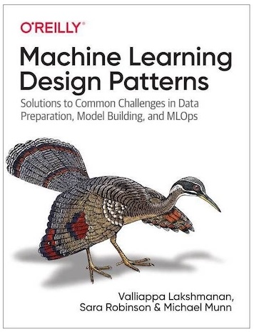

# Machine Learning Design Patterns.
Summary and practices of ML Design Patterns book

**Chapter 1:** [The Need for Machine Learning Design Patterns](https://github.com/matinkh/MLDesignPatterns/tree/main/Chapter%201%20)

**Chapter 2:** [Data Representation Design Patterns](https://github.com/matinkh/MLDesignPatterns/blob/main/Chapter%202/README.md)

**Chapter 3:** [Problem Representation Design Patterns](https://github.com/matinkh/MLDesignPatterns/blob/main/Chapter%203/README.md)
